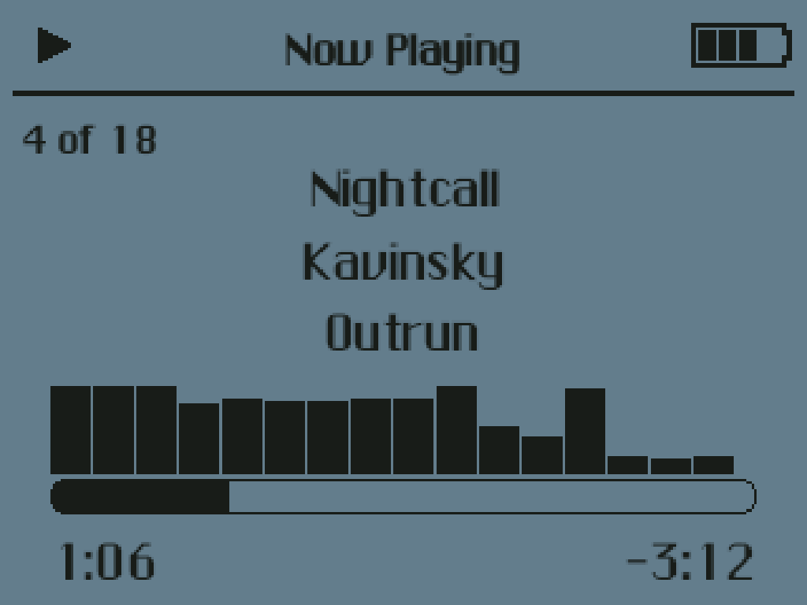

# Trimpod Classic For TrimUI Brick



## Description

I wanted my TrimUI Brick to feel like an iPod — a single-minded music player I could hand to anyone,
not a stack of menus. So I took Rockbox, stripped it down to just the music, and themed it after the
1st-generation iPod. It boots straight into the click-wheel-era interface: Chicago type, chevron
menus, page-slide transitions, and a Now Playing screen with a scrubber and an iPod-style volume bar.

The part I'm proudest of is the visualizer. Trimpod Classic ships a full Milkdrop/projectM music
visualizer — the same reactive presets people remember from Winamp — running on its own CPU core so
it stays smooth while the music plays. As far as I know, no other Rockbox port does this.

## User Disclaimer

Trimpod Classic is shared free with the TrimUI community and provided **as-is, without any
warranty**. It is an independent build of Rockbox; use it at your own risk. The author accepts no
liability for any damage to your device.

## Dev Disclaimer

While I am an experienced developer, note this is a personal-use project that's been human-directed
as far as top-down architecture but 100% slop-coded. Thus beware when forking. Here be dragons.

## Supported Platforms

- **tg5040** — TrimUI Brick
- I have no other devices to test with

## Features

| Feature | Notes |
|---|---|
| **Milkdrop / projectM visualizer** | Real-time, audio-reactive presets on a dedicated CPU core. A curated set ships; toggle them from Settings. |
| **1st-gen iPod interface** | Chicago typography, chevron menus, page-slide transitions, and a Now Playing screen with scrolling track info. |
| **Audio spectrum** | A live spectrum on the Now Playing screen. |
| **iPod volume bar** | The volume rocker works from any screen; a momentary iPod-style bar shows the level. |
| **Folder-based music** | Browse your own source folders rather than a fixed library (default `/mnt/SDCARD/Music`; add more in Settings). |
| **Colour themes** | Several iPod colour palettes (Settings → Power → Color). |

## Install

1. Download `Trimpod.pak.zip` from the [latest release](https://github.com/tyrannotorus/c-trimui-trimpod-classic-pak/releases).
2. Copy it to `/mnt/SDCARD/Tools/tg5040/` (mount the SD card or `adb push`).
3. Extract it so the `Trimpod Classic.pak` folder lands directly in `/mnt/SDCARD/Tools/tg5040/`, then
   delete the zip.
4. On device, open **Tools → Trimpod Classic**.
5. Put music under `/mnt/SDCARD/Music` (or add folders from Settings), then pick a track.

> **Note:** `launch.sh` must sit directly inside the `.pak` folder. Some unzip tools double-wrap the
> archive — if you see `Trimpod Classic.pak/Trimpod Classic.pak/`, move the inner folder up one level.

## Build

Cross-compiled in the NextUI `tg5040` Docker toolchain. Needs `docker` (and `adb` to deploy).

```sh
./build.sh      # cross-compile Rockbox -> build-trimpod/trimpod (+ the runtime zip)
./package.sh    # assemble dist/Trimpod.pak (+ dist/Trimpod.pak.zip)
adb push dist/Trimpod.pak "/mnt/SDCARD/Tools/tg5040/Trimpod Classic.pak"
```

`./build.sh clean` forces a fresh reconfigure. For code-only changes, push just the rebuilt binary
instead of the whole pak — a full deploy resets on-device settings.

### Architecture

Trimpod Classic is a custom Rockbox **SDL-application target** (`retro-handheld`) that renders at a
logical 320×240 and is hardware-upscaled 3.2× to the Brick's 1024×768 display. It runs hosted under
NextUI rather than on bare metal: `launch.sh` sources per-device sysfs paths, bind-mounts the pak's
data dir to `/tmp/trimpod`, applies the CPU governor, starts gptokeyb2 (gamepad → keys), and runs the
binary — then tears all of that down on exit.

### Layout

| Path | Role |
|---|---|
| `build.sh`, `package.sh` | build, then assemble the pak |
| `Dockerfile.trimpod` | the toolchain image (NextUI tg5040 + `zip` + an `sdl2-config` shim) |
| `pak/` | the pak skeleton: `launch.sh`, `pak.json`, `gptokeyb2` + controller config, `config.cfg`, `.sys` files |
| `assets/` | product assets — the theme, ChicagoFLF fonts, icons, Milkdrop presets, the skin build |
| `apps/`, `firmware/`, `lib/`, `tools/` | the Rockbox source tree + the Trimpod target |

> clangd flags missing `config.h` / undeclared identifiers in this tree — they resolve only inside
> the Docker build, which is the source of truth.

## License

Trimpod Classic is an independent build of [Rockbox](https://github.com/Rockbox/rockbox) and is
licensed under the **GNU General Public License v2.0**.

### Credits

- **Rockbox** — the firmware this is built from. GPLv2.
- **projectM** — the Milkdrop-compatible visualizer engine ([projectM-visualizer/projectm](https://github.com/projectM-visualizer/projectm)). LGPL 2.1.
- **Cream of the Crop** — the bundled Milkdrop preset pack ([presets-cream-of-the-crop](https://github.com/projectM-visualizer/presets-cream-of-the-crop)).
- **1ST_GEN_REMIX** theme by Monica G. — [themes.rockbox.org #3958](https://themes.rockbox.org/index.php?themeid=3958).
- **ChicagoFLF** — an openly-licensed Chicago typeface reproduction (bundled, anti-aliased).
- **gptokeyb2** — the gamepad-to-keyboard mapper.
- **NextUI** by LoveRetro — the launcher and toolchain this builds against.
- Hardware-enablement files adapted from IncognitoMan's GPL work.
